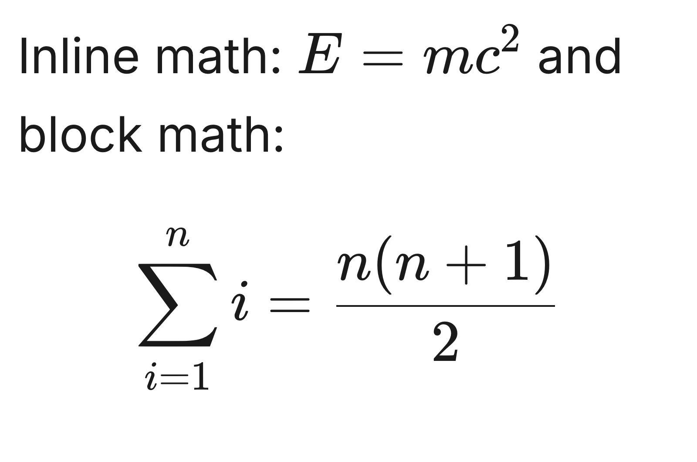
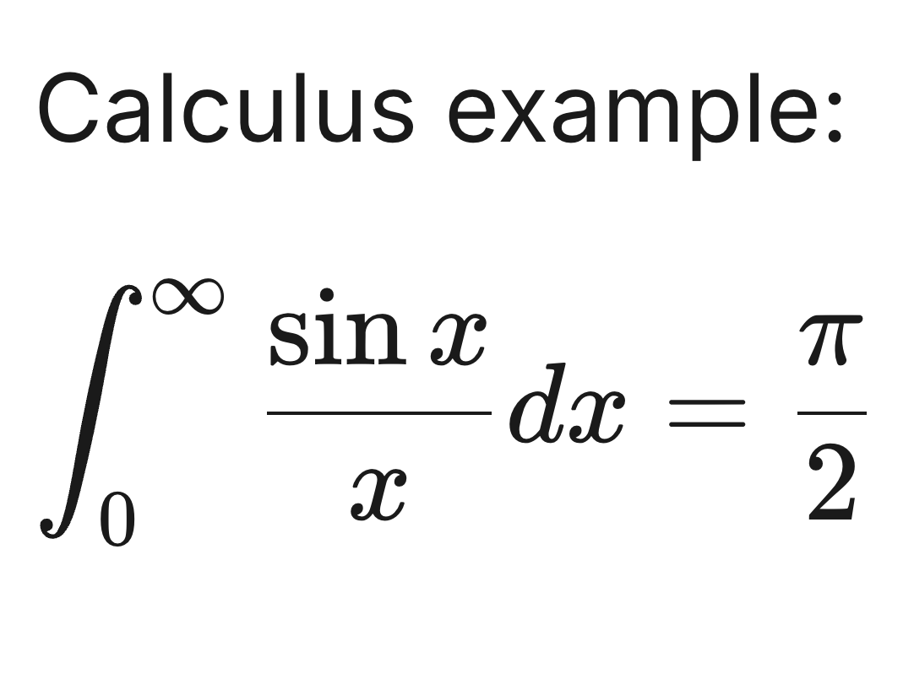
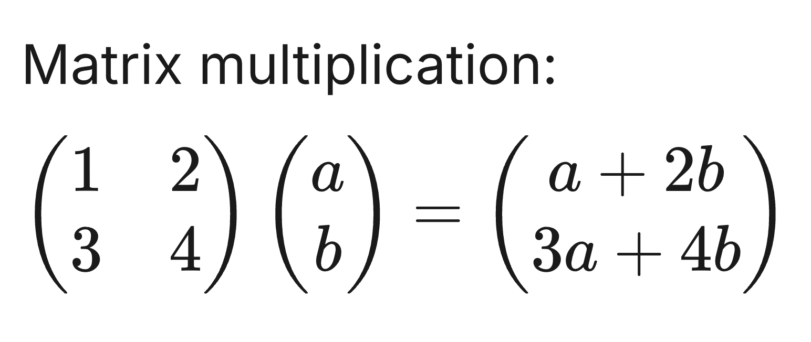
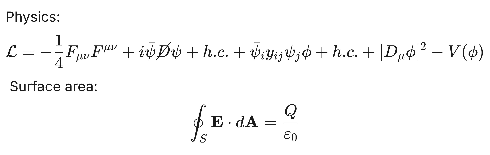
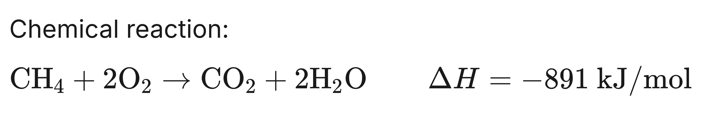
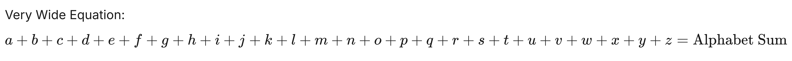

# 📐 LaTeX2Img-CLI

> A high-performance, beautiful LaTeX to image conversion tool and library powered by Puppeteer and KaTeX.

[](https://opensource.org/licenses/MIT)
[](https://nodejs.org/)

**LaTeX2Img-CLI** allows you to transform text containing LaTeX equations into crisp, high-resolution PNG images. Perfect for documentation, sharing equations on social media, or generating assets for web projects.

---

## ✨ Features

- 🚀 **Lightning Fast**: Powered by KaTeX for near-instant math typesetting.
- 🎨 **Premium Aesthetics**: Uses the Inter font for a modern, clean look.
- 📱 **High Resolution**: Captures at 2x DPI for ultra-sharp text and symbols.
- 🛠 **Flexible**: Supports mixed content (text + math), multiple delimiters (`$`, `$$`, `\(`, `\[`), and custom styling.
- 💻 **CLI & Library**: Use it directly from your terminal or integrate it into your Node.js apps.

---

## 🚀 Installation

```bash
# Clone the repository
git clone https://github.com/prajdabre/latex2img-cli.git
cd latex2img-cli

# Install dependencies
npm install

# Link for global CLI usage
npm link
```

---

## 🛠 Usage

### 1. Command Line Interface (CLI)

After linking, you can use the `latex2img` command:

```bash
latex2img 'The mass-energy equivalence: $E = mc^2$' -o output.png -s 32 -w 600
```

#### Options:
| Flag | Description | Default |
| :--- | :--- | :--- |
| `-o, --output` | Path to save the output image | `output.png` |
| `-s, --font-size` | Base font size (px) | `24` |
| `-p, --padding` | Padding around content (px) | `20` |
| `-w, --width` | Fixed width for content wrapping | `auto` |
| `-b, --background` | Background color (hex or name) | `white` |

### 2. Node.js Library

```javascript
const latexToImage = require('./index');

async function convert() {
    await latexToImage(
        "Quadratic formula: $$x = \\frac{-b \\pm \\sqrt{b^2 - 4ac}}{2a}$$",
        'quadratic.png',
        {
            fontSize: 28,
            padding: 40,
            backgroundColor: '#f8f9fa'
        }
    );
}

convert();
```

---

## 🧪 Examples

| Description | Rendered Result | Input Text |
| :--- | :--- | :--- |
| **Basic Math** (Inline + Block) |  | [Link](examples/inputs/basic_math.txt) |
| **Calculus** (Integrals) |  | [Link](examples/inputs/complex_calculus.txt) |
| **Linear Algebra** (Matrices) |  | [Link](examples/inputs/matrix_algebra.txt) |
| **Physics** (Standard Model) |  | [Link](examples/inputs/physics.txt) |
| **Chemistry** (Reactions) |  | [Link](examples/inputs/chemistry.txt) |
| **Stress Test** (Overflow/Wide) |  | [Link](examples/inputs/wide_alphabet.txt) |
| **Multi-line** (Lists/Notes) |  | [Link](examples/inputs/multi_line.txt) |

---

## 📜 License

This project is licensed under the MIT License - see the [LICENSE](LICENSE) file for details.

---

Created by [Raj Dabre](mailto:prajdabre@gmail.com)
