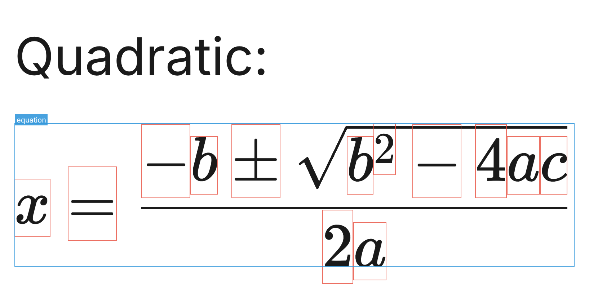
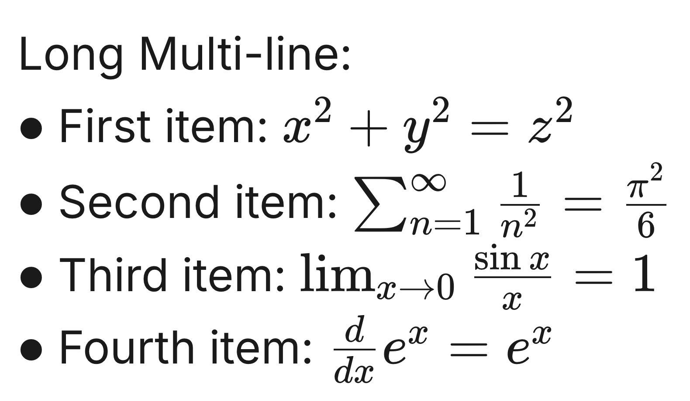
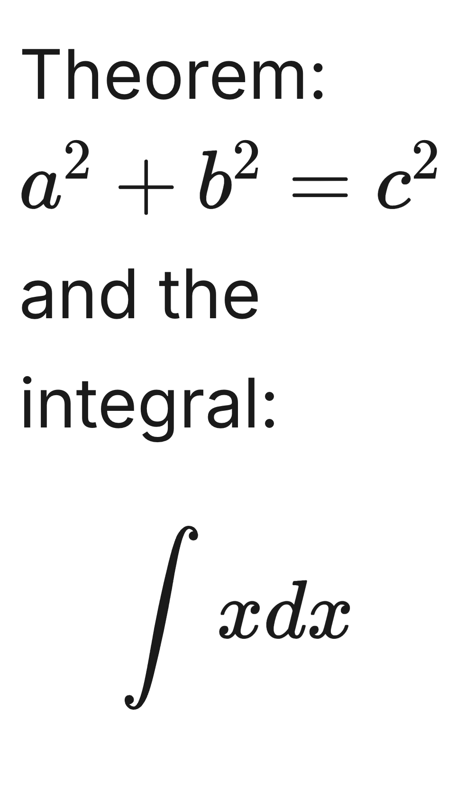
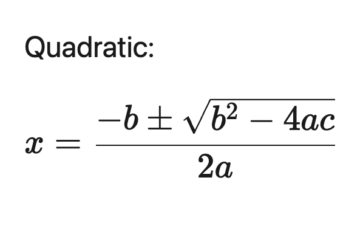
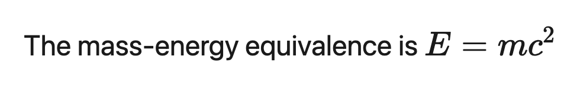
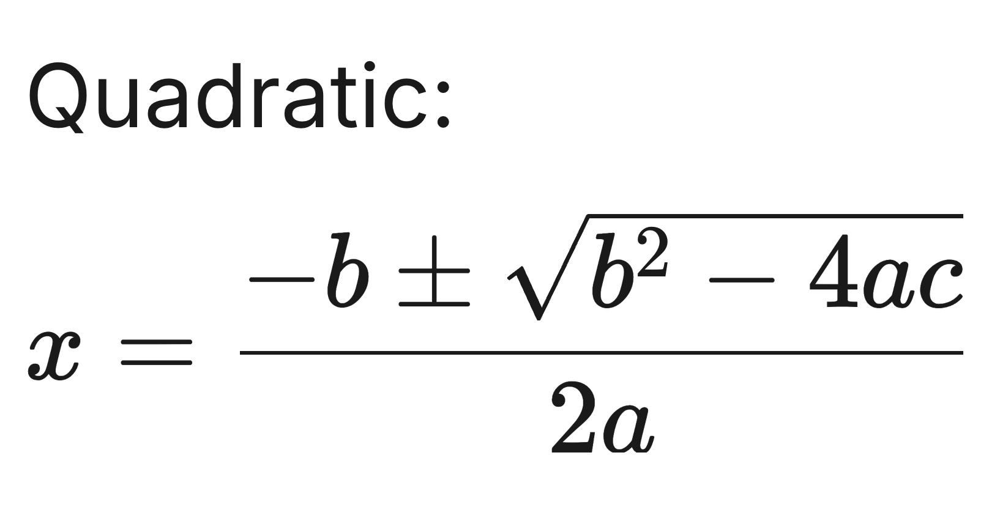
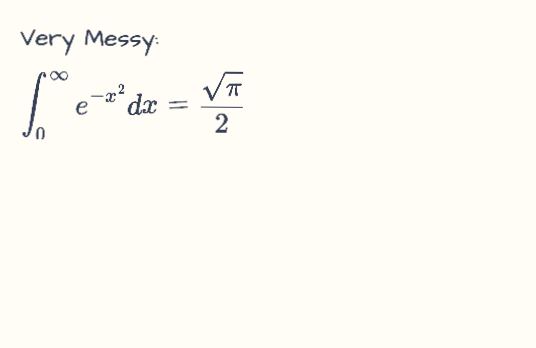

# 📐 LaTeX2Img-CLI

> A high-performance, beautiful LaTeX to image conversion tool and library powered by Puppeteer and KaTeX.

[](https://opensource.org/licenses/MIT)
[](https://nodejs.org/)

**LaTeX2Img-CLI** allows you to transform text containing LaTeX equations into crisp, high-resolution PNG images. Perfect for documentation, sharing equations on social media, or generating assets for web projects.

---

## ✨ Features

- 🚀 **Lightning Fast**: Powered by KaTeX for near-instant math typesetting.
- 🎨 **Premium Aesthetics**: Uses the Inter font for a modern, clean look.
- 📱 **High Resolution**: Captures at 2x DPI for ultra-sharp text and symbols.
- 🛠 **Flexible**: Supports mixed content (text + math), multiple delimiters (`$`, `$$`, `\(`, `\[`), and custom styling.
- 💻 **CLI & Library**: Use it directly from your terminal or integrate it into your Node.js apps.

---

## 🚀 Installation

```bash
# Clone the repository
git clone https://github.com/prajdabre/latex2img-cli.git
cd latex2img-cli

# Install dependencies
npm install

# Link for global CLI usage
npm link
```

---

## 🛠 Usage

### 1. Command Line Interface (CLI)

After linking, you can use the `latex2img` command:

```bash
latex2img 'The mass-energy equivalence: $E = mc^2$' -o output.png -s 32 -w 600
```

### Options

- `-o, --output <path>`: Output image path (default: `output.png`)
- `-s, --font-size <number>`: Font size in pixels (default: `24`)
- `-p, --padding <number>`: Padding in pixels (default: `20`)
- `-w, --width <number>`: Fixed width for text wrapping
- `-b, --background <color>`: Custom background color (CSS value)
- `-t, --theme <name>`: Theme choice (`modern`, `handwritten`, `chalkboard`)
- `-g, --grounded [level]`: Extract boxes to `.json` (`char` or `equation`)
- `-d, --debug [level]`: Render boxes on image (`char` or `equation`)
- `-n, --noise <0-1>`: Apply artifact synthesis (blur, jitter, ink bleed)

### 🔬 Grounded STEM Training Data

This tool is designed for generating high-quality **grounded** synthetic training data for STEM OCR models.

- **JSON Metadata**: Using `--grounded` produces a JSON file mapping every symbol to its precise `[x, y, w, h]` coordinates.
- **Debug View**: Using `--debug` renders those boxes (red for characters, blue for equations) directly on the image for verification.
- **Artifact Synthesis**: Using `--noise` applies randomized jitter, skew, and ink-bleed effects to simulate messy handwriting or poor scanning conditions, perfect for testing model robustness.

Example of debug output:


### 🎨 Themes

| Theme | Description | Preview |
| :--- | :--- | :--- |
| `modern` (default) | Clean, professional Inter font on white/transparent background. | [View](examples/standard/basic_math.png) |
| `handwritten` | Organic "Architects Daughter" font with a slight tilt and ink-blue color. | [View](examples/standard/handwritten_secret.png) |
| `chalkboard` | Classroom aesthetic with "Patrick Hand" font and slate-board background. | [View](examples/standard/chalkboard_lesson.png) |

### 2. Node.js Library

```javascript
const latexToImage = require('./index');

async function convert() {
    await latexToImage(
        "Quadratic formula: $$x = \\frac{-b \\pm \\sqrt{b^2 - 4ac}}{2a}$$",
        'quadratic.png',
        {
            fontSize: 28,
            padding: 40,
            backgroundColor: '#f8f9fa'
        }
    );
}

convert();
```

---

## 🧪 Examples

| Description | Rendered Result | Input Text |
| :--- | :--- | :--- |
| **Basic Math** (Inline + Block) |  | [Link](examples/inputs/basic_math.txt) |
| **Calculus** (Integrals) |  | [Link](examples/inputs/complex_calculus.txt) |
| **Linear Algebra** (Matrices) |  | [Link](examples/inputs/matrix_algebra.txt) |
| **Physics** (Standard Model) |  | [Link](examples/inputs/physics.txt) |
| **Chemistry** (Reactions) |  | [Link](examples/inputs/chemistry.txt) |
| **Stress Test** (Overflow/Wide) |  | [Link](examples/inputs/wide_alphabet.txt) |
| **Multi-line** (Lists/Notes) |  | [Link](examples/inputs/multi_line.txt) |
| **Theorem** (Mixed Content) |  | [Link](examples/inputs/theorem.txt) |
| **Quadratic** (Large Block) |  | [Link](examples/inputs/quadratic_formula.txt) |
| **Einstein** (Inline) |  | [Link](examples/inputs/einstein_energy.txt) |
| **Grounded** (Metadata) |  | [JSON](examples/grounded/grounded_quadratic.json) |
| **Synthetic** (Noisy) |  | [JSON](examples/synthetic/chaotic_math.json) |

---

## 📜 License

This project is licensed under the MIT License - see the [LICENSE](LICENSE) file for details.

---

Created by [Raj Dabre](mailto:prajdabre@gmail.com)
